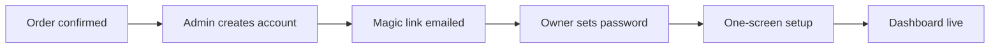
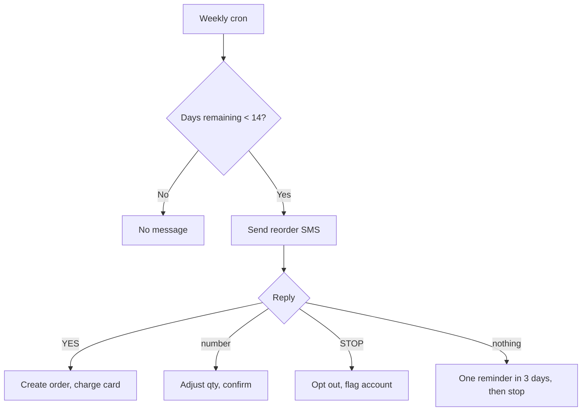
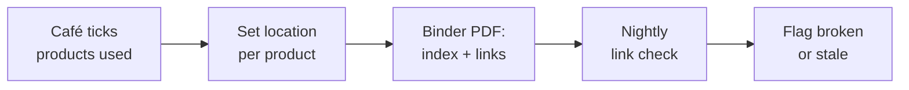
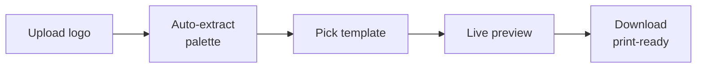

# Cup Casa OS — Build Spec

Sep 24, 2026 · @Sullivan Bryan

## What we're building and the design filter

Cup Casa OS is a free software suite bundled with cup purchases. It is not a revenue line. Its job is to make the cups hard to switch away from, and to reframe a compostable cup from a cost increase into a margin increase.

### The offer mechanic

On every quote and every monthly invoice, itemise it:

```
Cup Casa OS — Margin · Ordering · Compliance · Brand
Retail $427/mo ...................... INCLUDED   $0.00
```

Never say "free" — free reads as worthless. "$427 included" reads as theft. Seeing $0.00 next to a real number every month is the mechanism.

Three rules that keep it credible:

- **Never sold separately.** A café that wants the software buys cups. The refusal is the pitch.
- **Never discount cups alongside it.** The OS is what lets Cup Casa hold price against cheaper compostable competitors. Giving away both buys revenue instead of earning it.
- **Access follows the account, not the signup.** Login provisions on first order. Lapsed accounts go read-only, never deleted — loss aversion outperforms a contract, and their data stays exportable.

### The design filter

Every module must pass one test: **does account #100 cost more labour than account #1?**

If a feature needs a design hour, a config call, or a manual data refresh per café, it becomes a self-serve generator or it doesn't get built. This constraint shapes the architecture more than anything else — it is why the brand kit is a template engine rather than a service, and why SDS documents are linked rather than mirrored.

Corollary: onboarding is one decision. Connect Square, everything else populates. Anything needing more than one owner decision loses half of signups, and a dead account returns none of the retention this was built for.

### The through-line

Every module serves one sentence: **we make you more money per cup than we cost you.**

| Module | Job in the story |
| --- | --- |
| Switch ROI calculator | Proves it at the point of sale |
| Recipe costing | Proves it every month |
| Catering quotes, daypart analysis | Grows it |
| Price review nudge | Defends it |
| Compliance, brand kit | Goodwill that gets the meeting |

No other cup supplier in Canada is telling this story. Keep the product narrow enough that the story stays legible.

### Non-goals

Staff scheduling and payroll (7shifts owns it, support-heavy). Inventory beyond cups and lids — you get blamed when their bean count is wrong. Content calendars (crowded, low value, unused). Any form of POS replacement.

## Stack and architecture

Next.js 15 App Router, TypeScript, Tailwind, Supabase (Postgres + Auth + Storage), deployed on Vercel. This matches your existing stack, so nothing here is a new thing to learn.

### Rendering strategy

| Surface | Rendering | Why |
| --- | --- | --- |
| Marketing + calculator | Static / client-side | Must be fast and indexable; no auth |
| Dashboard | Server Components + server actions | Data-heavy, per-account, no public cache |
| Generators (PDF, images) | Route handlers on Node runtime | Need the filesystem and heavy libs |
| Cron jobs | Vercel Cron → route handlers | Monthly certs, link checks, nudges |

### Repo structure

```
app/
  (public)/
    calculator/            # Module 1 — no auth, indexable
    compliance/            # gated lead-capture landing
    locator/               # store locator, public
  (app)/
    dashboard/
    margin/                # recipes, pricing, daypart
    ordering/              # reorder, history, invoices
    compliance/            # SDS, WorkSafe, claims, signage
    brand/                 # brand kit generator
    impact/                # certificates
    settings/
  (admin)/
    accounts/ orders/ ingredients/ sds/ content/
  api/
    pdf/[template]/        # PDF generation
    render/[asset]/        # PNG/SVG asset generation
    webhooks/stripe/
    webhooks/square/
    cron/[job]/
lib/
  db/                      # generated Supabase types, queries
  calc/                    # PURE functions: all formulas live here
  pdf/                     # react-pdf document components
  render/                  # satori/resvg asset renderers
  integrations/            # square, stripe, twilio, gbp clients
content/
  sds/                     # SDS registry (JSON, not PDFs)
  worksafe/                # MDX templates
  claims/                  # MDX approved-claims content
  municipalities/          # CRD bin rules as JSON
  grants/                  # grants registry JSON
```

**The `lib/calc` rule:** every formula in this spec is a pure, unit-tested function with no database or React dependency. Costing maths is where quiet bugs cost cafés real money and cost you credibility. Test these before anything renders.

### PDF and image generation

- **PDFs** — `@react-pdf/renderer` on the Node runtime. Everything in this product is a document: quotes, certificates, binders, signage. One renderer, many templates.
- **Social and signage images** — `satori` + `@resvg/resvg-js` to turn JSX into PNG. Fast, no headless browser, runs in a route handler.
- **Print-ready artwork** — SVG generated server-side against a stored dieline, then PDF-wrapped at the exact trim size. Never rasterise print output.

Avoid Puppeteer. It is slow, memory-hungry, and painful on Vercel.

### Background jobs

Vercel Cron hitting authenticated route handlers. Four jobs total:

1. **Nightly** — SDS link health check, ingredient price staleness flags
2. **Weekly** — reorder burn-rate recalculation and SMS sends
3. **Monthly** — impact certificate generation, price review nudges
4. **Quarterly** — grants registry review reminder (to admin, not cafés)

### Multi-tenancy

One Supabase project. Row Level Security on every table, keyed to `account_id`. Admin access via a service-role client used only in `(admin)` routes and cron handlers — never in anything a café can reach.

## Data model

Postgres via Supabase. Every café-facing table carries `account_id` and an RLS policy restricting reads and writes to members of that account.

### Core

```sql
-- A customer of Cup Casa. One per business entity.
accounts (
  id uuid pk,
  business_name text not null,
  legal_name text,
  municipality text,              -- drives bin signage + health authority
  address jsonb,
  lat numeric, lng numeric,       -- locator + nearby-office features
  phone text, email text,
  status text not null,           -- prospect | active | lapsed | archived
  first_order_at timestamptz,
  last_order_at timestamptz,      -- drives the 90-day entitlement rule
  stripe_customer_id text,
  square_merchant_id text,
  locator_opt_in boolean default true,
  created_at timestamptz default now()
)

-- Supabase auth users mapped to accounts.
account_users (
  account_id uuid fk,
  user_id uuid fk,                -- auth.users
  role text not null,             -- owner | manager | staff
  primary key (account_id, user_id)
)

-- Cup Casa's own SKUs.
products (
  id uuid pk,
  sku text unique,                -- CUP-8, CUP-12, CUP-16, LID-12...
  name text,
  kind text,                      -- cup | lid | sleeve
  size_oz int,
  case_qty int not null,          -- 500 for cups
  unit_price_cad numeric not null,
  landed_cost_cad numeric,        -- admin only, never exposed via RLS
  weight_g numeric,               -- drives impact maths
  active boolean default true
)

orders (
  id uuid pk,
  account_id uuid fk,
  placed_at timestamptz,
  delivered_at timestamptz,
  channel text,                   -- manual | portal | sms_reorder
  delivery_fee_cad numeric default 50,
  subtotal_cad numeric, total_cad numeric,
  status text,                    -- draft | confirmed | delivered | cancelled
  stripe_payment_intent_id text
)

order_lines (
  id uuid pk,
  order_id uuid fk,
  product_id uuid fk,
  qty_units int not null,         -- always in cups, not cases
  unit_price_cad numeric not null
)
```

### Margin module

```sql
-- Global price library maintained by Cup Casa admin.
ingredients (
  id uuid pk,
  name text,                      -- "Whole milk (4L)", "Espresso beans"
  unit text,                      -- ml | g | each | shot
  pack_size numeric,              -- 4000 for a 4L jug
  pack_price_cad numeric,
  region text default 'BC',
  price_updated_at timestamptz,
  source text                     -- where the price came from
)

-- A café may override any global price with their own.
account_ingredient_prices (
  account_id uuid fk,
  ingredient_id uuid fk,
  pack_price_cad numeric not null,
  updated_at timestamptz,
  primary key (account_id, ingredient_id)
)

recipes (
  id uuid pk,
  account_id uuid fk,
  name text,                      -- "12oz Latte"
  size_oz int,
  menu_price_cad numeric,
  target_margin_pct numeric default 75,
  product_id uuid fk,             -- which Cup Casa cup it uses
  lid_product_id uuid fk,
  archived boolean default false
)

recipe_items (
  recipe_id uuid fk,
  ingredient_id uuid fk,
  qty numeric not null,           -- in the ingredient's unit
  primary key (recipe_id, ingredient_id)
)

-- Snapshot per recalculation so history is chartable.
recipe_cost_snapshots (
  id uuid pk,
  recipe_id uuid fk,
  computed_at timestamptz,
  ingredient_cost_cad numeric,
  packaging_cost_cad numeric,
  total_cost_cad numeric,
  margin_pct numeric
)

price_history (
  account_id uuid fk,
  recipe_id uuid fk,
  menu_price_cad numeric,
  changed_at timestamptz
)
```

### Compliance module

```sql
-- Global registry. Curated by admin, shared by all accounts.
sds_products (
  id uuid pk,
  product_name text,              -- "Urnex Cafiza"
  manufacturer text,
  category text,                  -- machine_cleaner | sanitizer | descaler...
  sds_url text not null,          -- manufacturer-hosted, never mirrored
  sds_url_checked_at timestamptz,
  sds_url_ok boolean,
  hazard_summary text,
  typical_location text           -- "Under bar", "Chemical cupboard"
)

-- Which products a given café has on site.
account_sds_items (
  account_id uuid fk,
  sds_product_id uuid fk,
  location text,
  added_at timestamptz,
  primary key (account_id, sds_product_id)
)

-- Generated binders, signage, certificates — one table for all outputs.
generated_documents (
  id uuid pk,
  account_id uuid fk,
  kind text not null,             -- sds_binder | worksafe_binder | bin_sign
                                  -- | impact_cert | catering_quote | brand_kit
  storage_path text,              -- Supabase Storage
  params jsonb,                   -- inputs, so it can be regenerated
  generated_at timestamptz,
  superseded_by uuid fk
)

-- Static reference content, versioned so you can prove what was published when.
content_versions (
  id uuid pk,
  slug text,                      -- worksafe/young-worker-orientation
  version int,
  body_mdx text,
  reviewed_by text,               -- the consultant who signed off
  reviewed_at timestamptz,
  published boolean
)

municipalities (
  id uuid pk,
  name text,                      -- Victoria, Saanich, Oak Bay, Esquimalt...
  regional_district text default 'CRD',
  health_authority text default 'Island Health',
  organics_accepted jsonb,        -- what the local program takes
  cup_disposal_guidance text,     -- what to tell customers about YOUR cup
  source_url text,
  verified_at timestamptz
)

grants (
  id uuid pk,
  name text, funder text,
  amount_range text, eligibility jsonb,
  deadline_kind text,             -- rolling | annual | closed
  next_deadline date,
  url text, verified_at timestamptz, active boolean
)
```

### Brand and impact

```sql
brand_profiles (
  account_id uuid pk fk,
  logo_path text,                 -- uploaded original
  logo_mono_path text,            -- auto-generated single-colour version
  primary_hex text, secondary_hex text,
  extracted_palette jsonb,        -- from the logo, offered as suggestions
  template_key text,              -- which sleeve template they picked
  tagline text
)

impact_snapshots (
  id uuid pk,
  account_id uuid fk,
  period_month date,
  cups_delivered int,
  plastic_avoided_g numeric,
  method_version text,            -- so old certificates stay defensible
  certificate_document_id uuid fk
)
```

### POS-gated

```sql
square_connections (
  account_id uuid pk fk,
  merchant_id text,
  access_token_encrypted text,
  refresh_token_encrypted text,
  expires_at timestamptz,
  location_ids jsonb,
  last_sync_at timestamptz,
  sync_status text
)

-- Aggregated, never raw transactions. Keeps storage small and PIPA exposure low.
pos_daily_stats (
  account_id uuid fk,
  business_date date,
  hour int,                       -- 0-23, null for daily roll-up
  transaction_count int,
  net_sales_cad numeric,
  item_breakdown jsonb,
  primary key (account_id, business_date, hour)
)
```

### Notes on the schema

- `landed_cost_cad` must never be readable by a café. Put it behind a separate admin-only view rather than trusting a column-level policy.
- `order_lines.qty_units` is always in cups, never cases. Your own site has already confused 500 vs 1,000 once — store the atomic unit and derive cases in the UI.
- `generated_documents.params` is what makes regeneration free. Never store a document without the inputs that produced it.
- `content_versions.reviewed_by` exists because compliance content needs an audit trail. If a café ever fails an inspection holding your binder, you need to show what you published and who checked it.

## Auth, accounts and entitlement

### How a café gets in

No public signup. Accounts are provisioned by Cup Casa when an order is confirmed, which keeps the "comes with the cups" promise structurally true rather than policy-enforced.



Auth is Supabase Auth with magic links plus optional password. No social login — café owners use a shared business email and OAuth adds friction for nothing.

### The one-screen setup

This is the only onboarding step, and it must fit on one screen with one primary action:

1. Confirm business name and address (pre-filled from the order)
2. **Connect Square** — the primary button
3. "Skip for now" — secondary, and everything still works manually

Everything else populates from the order and the Square connection. Do not ask for their logo, their menu, or their chemicals here — those live in the modules that need them, prompted in context.

### Entitlement

One rule, computed not stored: **an account is active if it has a delivered order in the last 90 days.**

| State | Condition | What they get |
| --- | --- | --- |
| `prospect` | No delivered order | Calculator and compliance landing only |
| `active` | Delivered order within 90 days | Everything |
| `lapsed` | Last delivery over 90 days ago | Read-only: can view and export, cannot generate or edit |
| `archived` | Manual admin action | No login |

Implement as a Postgres function so it can't drift between UI and API:

```sql
create or replace function account_is_active(a uuid)
returns boolean language sql stable as $$
  select exists (
    select 1 from orders
    where account_id = a
      and status = 'delivered'
      and delivered_at > now() - interval '90 days'
  );
$$;
```

### What lapsed must never do

- **Never delete data.** Their recipes, customer list and document history stay indefinitely.
- **Never hide what they'd lose.** A lapsed dashboard shows their numbers with generation disabled and a single line: *"Place an order to reactivate."* Seeing the locked value is the retention mechanism.
- **Always allow export.** A CSV and PDF export of everything, available in every state. It costs you nothing, it is the ethical floor, and under PIPA they are entitled to their own records.

Grace behaviour: at day 75 the weekly reorder SMS changes tone from "time to order" to "your OS access pauses in 15 days." Do not surprise anyone.

### Roles

| Role | Can |
| --- | --- |
| `owner` | Everything, including pricing, payment methods, exports |
| `manager` | Reorder, recipes, generate documents. No payment or export |
| `staff` | Read compliance documents and SOPs only |

The `staff` role exists for one reason: safety data sheets must be readily available to workers, and a manager-only login defeats that. Staff access should be a shared read-only link or a simple PIN, not an individual account per barista — café turnover makes per-person accounts unmanageable.

## Module 1 — Switch ROI Calculator

**Build this first.** Public, no login, no integrations, no database beyond a leads table. It works before the container lands and it is the only module that closes deals.

Route: `/calculator`. Indexable, fast, mobile-first — café owners will open it on a phone while you stand at their counter.

### Inputs

Four fields maximum. Every additional field loses users.

| Field | Type | Default | Notes |
| --- | --- | --- | --- |
| Cups per day | number | 250 | Slider plus number input |
| Average drink price | currency | 5.75 | Their signature latte |
| Current cup cost | currency/unit | 0.14 | Pre-filled, "not sure?" sets typical |
| Days open per week | number | 7 | Affects annual roll-up |

One toggle: **price increase** — $0.10 / $0.15 / $0.25, defaulting to $0.15 because that is the figure your own survey tested.

### The maths

All of this lives in `lib/calc/roi.ts` as pure functions.

```latex
\text{annual cups} = \text{cups per day} \times \text{days per week} \times 52
```

```latex
\text{added cost} = \text{annual cups} \times (\text{cupcasa price} - \text{current cup cost})
```

```latex
\text{added revenue} = \text{annual cups} \times \Delta\text{price} \times \text{acceptance rate}
```

```latex
\text{net gain} = \text{added revenue} - \text{added cost}
```

Acceptance rate defaults to 1.0 in the headline number, with a conservative toggle at 0.90 based on your survey. Never model it above your measured figure — if a café checks your arithmetic and finds it flattering, you have lost the sale and the relationship.

`cupcasa price` comes from the `products` table by size, so it updates when you reprice. Do not hard-code it.

### Output

Three numbers, in this visual hierarchy:

1. **Net annual gain** — large, the hero figure
2. Added cup cost per year — small, shown honestly
3. Added revenue per year — small

Then one sentence: *"Switching costs you $X more in cups and earns you $Y more in revenue. You keep $Z."*

Below that, a per-cup breakdown table, because owners think in cents per cup:

| Per cup | Now | With Cup Casa |
| --- | --- | --- |
| Cup cost | $0.14 | $0.22 |
| Drink price | $5.75 | $5.90 |
| Margin change | — | +$0.07 |

### The proof block — this is the actual product

Directly under the result, not buried:

> **We asked 167 people on Victoria's Inner Harbour whether they'd pay $0.15 more for a coffee.**
>
> - 87% yes, for no microplastics
> - 90% yes, for home compostable
> - 98% yes, for both

Link the interview videos from the Cup Casa Instagram. This is primary research no competitor has, and it converts the calculator from a spreadsheet into an argument. Put a plain-language method note beneath it — where, when, how many, what was asked. Café owners are not statisticians but they can smell a number with no method behind it.

### Lead capture

Show the result first, gate nothing. Then below the result: *"Email me this breakdown"* — name, café, email. On submit, generate the PDF (same numbers, Cup Casa branded) and email it, creating an account row with `status = 'prospect'` and the inputs in `params`.

That gives you a lead list where every row includes their daily volume — which is your qualification score, handed over voluntarily.

### How sales uses it

- Link in all three email lists you're already running: Victoria re-engagement, cold Greater Victoria, and the non-café cup users
- Open it on your phone at the counter and let the owner type their own numbers — the figure lands differently when they entered it
- Embed the result PDF in the Fort Cafe LOI and the founding-café proposals to Habit, Saint Cecilia and Jackson Brothers

### Two things not to do

**Don't gate the result.** The number is the hook. Gating it halves conversion and makes you look like every other vendor.

**Don't let it output a loss.** For a café whose current cup is extremely cheap and who refuses any price increase, the honest answer is negative. Handle that case explicitly with a different frame — what the switch is worth in customer preference and compliance readiness — rather than showing a red number. But never fake the arithmetic to avoid it.

## Module 2 — Recipe Costing Engine

The stickiest thing in the product. Once a café's recipes live in your system they do not leave, and it turns the calculator's one-time argument into a monthly one.

Route: `/margin/recipes`.

### Ingredient library

You maintain a global BC price library; cafés override anything they know better. Seed it with roughly 40 items covering what a café actually buys: milk (whole, 2%, oat, almond, soy), espresso beans, syrups, chocolate, chai, tea, matcha, cups, lids, sleeves, sugar, cocoa.

Store prices as **pack price plus pack size**, never unit cost. Owners know a 4L milk jug costs $6.40; they do not know milk costs $0.0016/ml. Derive the unit cost:

```latex
\text{unit cost} = \frac{\text{pack price}}{\text{pack size}}
```

Every global price carries `price_updated_at` and `source`. The nightly job flags anything over 90 days old in the admin panel. Stale prices are how this module quietly starts lying.

### Recipe builder

One screen: name, size, menu price, then rows of ingredient plus quantity. Ship with prefilled templates for the eight drinks every café sells — espresso, americano, latte, cappuccino, flat white, mocha, drip, chai — in 8/12/16oz. A café should be able to accept the defaults, adjust two numbers, and be done in four minutes.

Packaging is not a manual ingredient. It resolves from `recipes.product_id` and `lid_product_id` against your live `products` prices, so when you reprice, every café's costing updates without anyone touching it.

### Cost roll-up

```latex
\text{ingredient cost} = \sum_i \left( \text{qty}_i \times \text{unit cost}_i \right)
```

```latex
\text{packaging cost} = \text{cup price} + \text{lid price} + \text{sleeve price}
```

```latex
\text{margin \%} = \frac{\text{menu price} - (\text{ingredient cost} + \text{packaging cost})}{\text{menu price}} \times 100
```

Note what is deliberately excluded: **labour and overhead.** Include them and every drink looks unprofitable, the owner disbelieves the tool, and it dies. Report gross margin on cost of goods, label it plainly as such, and offer labour as an optional advanced input that defaults off.

### Margin flagging

`target_margin_pct` defaults to 75% — typical for specialty coffee gross margin. Drinks are flagged red below target, amber within 5 points, green above. The list sorts worst-first by default, because the value is in finding the bad ones.

For every red drink, show the exact fix rather than the problem: *"Raise to $6.10 to hit 75%"* — rounded to a real menu price, not $6.0714.

### Price propagation

When you update a global ingredient price:

1. Recalculate every affected recipe across all accounts
2. Write a new `recipe_cost_snapshots` row per recipe
3. Queue a notification for any account where a drink crossed from green or amber into red

That notification is the product. *"Whole milk is up 6%. Your 16oz latte just dropped to 71% margin. $6.25 puts you back on target."* No other supplier sends that email, and it arrives from the company whose product is on the invoice.

Snapshots make margin history chartable — a café seeing twelve months of margin drift is a café that raises prices, which is a café that can afford your cup.

### Price review nudge

Piggybacks on the same data with two additions: the date of their last menu price change from `price_history`, and a commodity feed for coffee and dairy.

Monthly cron, sent only when there is something real to say:

> Beans are up 14% this quarter. You last raised prices 19 months ago. A $0.25 increase across your top five drinks is about $14,200 a year and puts every drink back above 75%.

Suppress it if they raised prices within 90 days. A nudge that ignores what they just did is a nudge they unsubscribe from.

The commodity feed is the one piece needing an outside source — coffee C-market and BC dairy wholesale pricing. Build the module with a `commodity_prices` table and a manual admin entry form first. Automate the feed later; a monthly manual entry by you is two minutes and unblocks the whole feature.

## Module 3 — Catering Quote Builder

Cafés get asked to do office drops, weddings and markets, and they price it by guessing — usually low. This tool fixes that, and every quote it wins is cup volume for you.

Route: `/margin/catering`.

### Inputs

| Field | Notes |
| --- | --- |
| Event type | Office drop, wedding, market, conference, film crew |
| Guest count | Drives everything downstream |
| Duration (hours) | Separates a 2-hour drop from an 8-hour market |
| Service style | Drop-off, urns, staffed bar |
| Drinks offered | Multi-select from their own recipes |
| Travel distance | km each way |
| Staff required | Count and hourly rate |
| Date | Date chip on the quote |

### Consumption model

The part cafés get wrong. Drinks per guest is not one.

```latex
\text{drinks} = \text{guests} \times \text{drinks per guest} \times \text{waste factor}
```

Starting assumptions, all editable and clearly labelled as estimates:

| Event type | Drinks per guest | Notes |
| --- | --- | --- |
| Office drop (2h) | 1.2 | Some take two |
| Conference (full day) | 2.5 | Morning and afternoon service |
| Wedding | 1.5 | Concentrated after dinner |
| Market (per hour) | 0.15 × footfall | Footfall, not guests |

Waste factor 1.08 for urn service (you brew in fixed volumes), 1.03 for made-to-order.

Cup and lid counts derive from this and feed a **"you'll need 380 cups — you have about 140 left"** line that links straight into reorder. That connection is the point of building this module.

### Pricing model

```latex
\text{cost} = \text{COGS} + \text{labour} + \text{travel} + \text{equipment}
```

```latex
\text{price} = \frac{\text{cost}}{1 - \text{target margin}}
```

COGS comes from their actual recipe costs — this module is worthless without Module 2, which is a good reason to build them together. Labour is staff × hours × rate, plus setup and teardown (default 1.5h total, and cafés always forget it). Travel at a per-km rate plus driver time. Equipment as a flat urn/dispenser rental line if they choose.

Default target margin 65% for catering — lower than retail because volume and certainty are worth something, but far above the 30% they'd quote by instinct.

### Output

A branded PDF quote using their `brand_profile`: their logo, their colours, a line-item breakdown, total, validity date as a date chip, and terms.

Three things it must include that cafés always omit:

- **A minimum guest count** below which the price doesn't hold
- **A confirmation deadline** — final numbers N days out
- **A cancellation policy** — deposit non-refundable inside N days

Show the owner their own margin on screen, never on the PDF. Two views of one document, one of them private.

### Reusable quotes

Save every quote to `generated_documents` with full `params`. Office coffee is repeat business; duplicating last month's quote in two clicks is most of the value after the first use.

Track quote outcomes — won, lost, no response. After twenty quotes across accounts you know the win rate by event type and price point, which is a benchmark nobody else can offer and which feeds Module 9.

## Module 4 — Reorder Autopilot

The retention engine. Nothing else on this list holds an account like being the system they order through. You had this slated for early 2027 — move it to launch.

Route: `/ordering`.

### Burn-rate model

Derive daily consumption per SKU. Two sources, in preference order:

1. **Square** — drink transaction counts mapped to cup sizes. Accurate, zero effort from them.
2. **Delivery interval** — units delivered divided by days between deliveries. Crude but works from order two.

```latex
\text{burn rate} = \frac{\text{units delivered in window}}{\text{days in window}}
```

Use a 3-delivery rolling window, weighted toward recent. Seasonality matters on the Island — a Victoria café's summer volume is materially different from February — so never extrapolate an August rate into September without decay.

```latex
\text{days remaining} = \frac{\text{estimated on hand}}{\text{burn rate}}
```

`estimated on hand` decays from the last delivery. Every SMS confirmation is a chance to correct it — "about how many cases left?" — and a corrected count resets the estimate. Expect drift and design for correction rather than precision.

### The SMS flow

Weekly cron, one message, sent Tuesday morning so delivery lands before the weekend.



Message shape:

> Cup Casa: you're about 9 days from running out of 12oz cups. Reply YES to send 4,000 cups ($880 + $50 delivery) for Thursday, or a number to change the amount.

Rules that keep this from becoming spam:

- **Maximum one message per account per week.** Hard cap in code, not convention.
- **Never send twice for the same stockout.** One reminder, then silence until they order.
- **STOP works instantly** and permanently. Required, and it is also just decent.
- **Never auto-charge without a reply.** A reply is consent; a silence is not. Auto-shipping without confirmation is how you lose a café permanently.

### Delivery-fee optimiser

This is the trust-builder. Your own terms include a $50 delivery fee and a 1,000 cup minimum, which punishes bad ordering. A tool that actively saves them that fee reads as being on their side.

Before sending, check every SKU's days-remaining. If a second SKU falls due within 21 days, bundle it:

> Adding 2,000 12oz now saves you a second $50 delivery in three weeks.

And surface the per-cup landed cost including the fee, so they can see the effect of order size themselves:

| Order size | Cups cost | Delivery | Per cup |
| --- | --- | --- | --- |
| 1,000 | $220 | $50 | $0.270 |
| 4,000 | $880 | $50 | $0.233 |
| 10,000 | $2,200 | $50 | $0.225 |

That table sells larger orders better than any discount, and it does it by telling the truth.

### Payment

Stripe with a saved payment method. `setup_intent` at onboarding, `payment_intent` off-session on confirmation. Your terms are payment on delivery, so either capture on `delivered_at` or authorise on confirmation and capture on delivery — pick one and make the SMS copy match it exactly.

Handle failed off-session charges as a human problem, not an error state: notify you, notify them, keep the order. Never cancel a café's cups over a declined card.

### Cost control

SMS is the only line item here that scales with accounts. Build the cap on day one:

- Per-account monthly send limit (default 8), enforced in the sending function
- Global monthly spend ceiling that hard-stops sends and alerts you
- Log every send with cost so you can see the per-account economics

At one message per account per week you are looking at very low monthly cost per café at Canadian SMS rates — trivial against a cup order. It only becomes a problem through a loop bug, which is exactly what the caps exist to contain.

## Module 5 — Compliance Center: the WorkSafe binder

Your best gated asset. A café owner will trade an email address for a WorkSafe binder, and this works with zero customers — ship it in October alongside the calculator.

Routes: `/compliance/*` inside the app, plus a public gated landing at `/compliance`.

### What the regulation actually requires

Verified against WorkSafeBC:

- Every product classified as hazardous under WHMIS 2015 found in a workplace **must have a safety data sheet**, available on site for workers to reference ([WorkSafeBC WHMIS 2015](https://www.worksafebc.com/en/health-safety/hazards-exposures/whmis/whmis-2015))
- **BC-specific:** SDSs must be **checked every three years** to confirm they hold current information. This differs from the federal position and is a genuine product feature — nobody tracks it
- Hazardous products transferred out of their original container need a **workplace label**
- New and young worker orientation must cover **rights and responsibilities, workplace hazards, and safe work procedures**, and the employer must **maintain records** of education, training and supervision for each worker ([Training & orienting workers](https://www.worksafebc.com/en/health-safety/create-manage/training-orientation))

The three-year review rule is the hook for the whole module. Build a `sds_reviewed_at` date per account item and surface a countdown. "3 of your 11 SDS are due for review" is a reason to log in that no competitor offers.

### SDS generator — link out, never mirror

The critical architecture decision. Mirroring manufacturer PDFs means you own their currency, which breaks the build-once rule and creates real liability when one goes stale.



The registry carries the manufacturer's hosted URL, a retrieval date, and a hazard summary. The generated binder is an **index with QR codes and URLs**, plus a cover sheet, the hazardous products inventory with locations, and a printable "SDS are located here" wall sign.

Seed the registry with what a café actually has:

| Category | Typical products |
| --- | --- |
| Espresso machine cleaner | Urnex Cafiza, Puly Caff |
| Descaler | Urnex Dezcal, citric acid |
| Milk line / steam wand | Urnex Rinza |
| Sanitizer | Quat sanitizer, Star San |
| Bleach | Sodium hypochlorite |
| Degreaser | Kitchen degreasers |
| Dish detergent | Commercial dishwasher detergent |
| Drain cleaner | Caustic drain products |
| Gas | CO₂ cylinders if they carbonate |

Nightly cron does a HEAD request per URL and writes `sds_url_ok`. Broken links go to an admin queue, not to the café — they should never see a dead link, you should fix it before they look.

### Young worker orientation pack

The strongest single item in the module. Cafés hire 16- and 17-year-olds constantly, documented orientation is required, and almost nobody does it properly.

Generates a filled orientation package: a checklist covering the three mandated topics, a café-specific hazard list (steam, hot water, slips, knives, chemicals), a worker-and-supervisor sign-off sheet, and a training record that goes in their file.

Store completions in a `worker_orientations` table so the binder can show "7 workers oriented, 2 outstanding." That turns a document into a live record, which is what an inspector actually wants to see.

### Safety procedures

MDX content templated with their business name, built around the real injury profile of a café rather than generic industrial boilerplate:

- **Burns and scalds** — steam wands, hot water taps, milk jugs
- **Chemical handling** — dilution, never mixing, PPE, eyewash
- **Slips and trips** — wet floors behind the bar, spill response
- **Knives and slicers**
- **Working alone** — opening and closing shifts
- **Emergency procedures** — evacuation, first aid, incident reporting

### Forms and logs

Fillable and printable: incident report, incident investigation, monthly safety inspection checklist, safety meeting minutes, first aid record. Prefilled with their details, dated, ready to sign.

The binder assembles all of it into one PDF with a table of contents and a generation date, so it can be printed and put in an actual binder on a shelf — which is still how most cafés will use it.

### What must be true before this ships

One review pass by a BC safety consultant, recorded in `content_versions.reviewed_by`. A few hundred dollars once. You are 18 and selling to businesses — a reviewed binder is the difference between looking like a serious supplier and looking like a liability.

Every page carries: *"Template for your use. Verify against WorkSafeBC requirements and your suppliers' current safety data sheets. Cup Casa does not certify your workplace."*

## Module 6 — Compliance Center: claims, signage, health, grants

### Greenwashing and claims kit

The module only Cup Casa can build, because it rests on certification work you already paid for. Cafés making "eco" claims are exposed under the Competition Act's greenwashing provisions and have no idea.

Contents:

- **Approved claim language** — exactly what a café can say about your cup, in three lengths: a menu line, a chalkboard sentence, a paragraph for their website
- **Claims to avoid** — "biodegradable" unqualified, "eco-friendly", "100% compostable" where facility access doesn't support it, recycling symbols on a compostable item
- **Your certificates**, downloadable — TÜV Rheinland home compostable, plus the DIN CERTCO certificates behind the printed cups
- **A substantiation one-pager** they can hand a customer or an inspector who asks

The legal architecture that matters: the Competition Act requires environmental claims to be backed by adequate and proper testing. Your certificates substantiate claims **about the cup**. They do not substantiate claims about the café's operation, their waste stream, or where the cup ends up. Draw that line explicitly in the content, because a café that says "we're zero waste" on the strength of your cup has made a claim you can't back and will point at you when challenged.

This section needs the same treatment as the WorkSafe binder: one review pass, by a lawyer this time, recorded in `content_versions`.

### Bin signage generator

CRD municipalities differ in what their organics programs accept, and staff get it wrong constantly. `municipalities` holds the rules per municipality with a `source_url` and `verified_at`.

The café's municipality is already on their account, so this is a one-click generator producing:

- **Back-of-house poster** — what goes where, in their municipality, including your cup specifically
- **Customer-facing bin decals** — sized for standard bin openings, print-ready PDF
- **A short honest line about cup disposal.** Home compostable certification is about the cup's behaviour in a home compost, not a guarantee the local industrial facility accepts it. If a municipality's program doesn't take lined paper cups, the signage must say so. Getting this wrong is a greenwashing exposure for you, not just for them.

Start with the café-dense municipalities: Victoria, Saanich, Oak Bay, Esquimalt, View Royal. Verify each against the municipality's own published program and store the link.

### Health inspection self-audit

Island Health inspects food premises in your region under the BC [Food Premises Regulation](https://www.bclaws.gov.bc.ca/civix/document/id/complete/statreg/11_210_99). A pre-inspection self-audit is pure anxiety relief and almost no build.

Structure it as the checklist an operator can walk with a clipboard: temperatures and logs, handwashing stations, sanitizer concentration, food storage and separation, surfaces and equipment, pest evidence, staff FOODSAFE certification currency, their food safety plan and permit on display.

Output: a completed self-audit PDF with a date, the items that failed, and a fix-by field. Keep the history so they can show improvement over time.

Source this against [Island Health's food safety guidance](https://www.islandhealth.ca/health-topics/food-safety/food-safety) and their own operator brochure rather than generic Canadian checklists — regional specificity is the entire value.

### Grants and rebates database

A filterable list in `grants`. You already researched CanExport, Futurpreneur, the BC Digital Marketing Grant and SR&ED for Cup Casa — much of that applies to cafés too, plus small business energy-efficiency rebates and hiring or student wage subsidies.

Filter by: business age, employee count, municipality, purpose. Each row carries a verification date and the funder's own URL. Quarterly admin reminder to re-verify, with anything unverified for two quarters auto-hidden rather than shown stale.

This is the one item in the compliance module that can quietly become wrong in a way that costs a café a deadline. Auto-hide is the safety valve.

### Why these four live together

One tab in the dashboard, one sentence on the landing page: **the paperwork a café is supposed to have and doesn't.** That framing is what makes it a gated asset worth an email address, and it is the reason a café that has never heard of you takes the meeting.

## Module 7 — Brand Kit Generator

The module that had to be rescued from failing the build-once filter. Designing per café is a service; generating from templates is a product. Same perceived value, zero hours.

Route: `/brand`.

### Flow



### Logo handling

Accept PNG, JPG, SVG and PDF. Then do the work they can't:

- **Background removal** on raster logos, plus a warning when the result is poor rather than shipping a bad cutout silently
- **Mono version** generated automatically — needed for single-colour sleeve printing and the cheapest print option
- **Palette extraction** — dominant colours offered as suggestions, not imposed
- **Resolution check** — if their logo is 400px wide it will print badly on a sleeve, and they need to know before ordering, not after

Store the original untouched. Café logos are often the only copy they have, and losing it would be unforgivable.

### Templates

Six sleeve templates, each a parameterised SVG against your supplier's real dieline:

| Template | Character |
| --- | --- |
| Logo centred | Safest, works with any mark |
| Logo + tagline | Two lines of their text |
| Wordmark band | Type-led, no logo needed |
| Pattern + badge | Repeating motif, logo badge |
| Sustainability co-brand | Their logo + your certification mark |
| Minimal stamp | Single-colour, cheapest to print |

Build the dieline as data, not as a drawing: trim, bleed, safe area, seam allowance and warp for the cone. Your 12oz sidewall dieline is 90×60×110mm — get the sleeve equivalent from the supplier in writing before building templates, and store it in a `dielines` table so a supplier change is a data update rather than a redesign.

### Outputs

One click produces the full set:

- **Sleeve artwork** — print-ready PDF, CMYK, bleed, crop marks, at the supplier's exact trim
- **A-frame poster** — the signage you're already making for founding cafés, templated
- **Till card** — tent-fold, the compostable story in three lines
- **Window decal** — die-cut outline included
- **Instagram set** — four posts: "we've switched", the certification, a behind-the-counter frame, their impact number
- **Menu chip** — a small mark for their printed menu

Everything server-rendered via satori for images and a react-pdf template for print. No design tool, no human, no queue.

### The commercial logic

The generator is free. The sleeves are not.

They finish a design, see their logo on a mockup, and now they want 5,000 printed. That order is a second revenue line per account on top of cups, and the thing you gave away cost you nothing. Put the pricing directly in the download screen — the yes is nearly automatic when they're already looking at the mockup.

Before building templates, confirm with your sleeve supplier: digital print MOQ and per-unit at 1k, 5k and 10k. If MOQ is low enough, a first-500-free closer works. If it's 20,000+, sleeves are a phase-2 product and the generator still earns its place on the decal, A-frame and socials.

### Where this loses its way

The temptation will be to add controls — fonts, spacing, layers. Don't. Six templates and a colour picker. A café owner with a full design tool produces something worse than your worst template and blames the tool. Constraint is the feature.

## Module 8 — Impact certificates and the locator

### Impact certificates

Monthly cron over delivered orders. Cheap to build, and it gives cafés something to post — which is free marketing pointed back at you.

```latex
\text{plastic avoided (g)} = \text{cups delivered} \times \text{PE lining mass per conventional cup (g)}
```

The number must be defensible. Be precise about what is claimed: **plastic lining avoided** by using a PHA-lined cup instead of a conventional PE-lined one. Not "plastic saved from the ocean", not "waste diverted", not a CO₂ figure unless you have a real LCA behind it.

Get the PE lining mass per cup from your own supplier data or a published figure, store it as `method_version`, and cite the source on the certificate itself. When the method improves, old certificates keep their old version and stay honest.

Output per month:

- **A one-page PDF certificate** — café name, period, cups, grams of lining avoided, method note, your certification marks
- **A square social graphic** — their logo, the number, ready to post
- **A cumulative figure** since they joined, which is the number that grows and keeps them opening the email

Suppress the certificate for a month with no deliveries. A certificate reading zero is worse than no certificate.

### Why this matters commercially

Cafés bidding on corporate catering, campus or municipal accounts increasingly face green procurement questions. A dated certificate with real certification marks behind it is genuinely useful in that context — which is what separates this from a vanity graphic.

### Store locator

You're running Meta ads to the locator anyway, so "we send you customers" is true and costs nothing incremental.

Public route `/locator`: map plus list, filtered by municipality, each café with name, address, hours, and a link to their own site and Instagram. Opt-in via `accounts.locator_opt_in`, defaulting on, with an easy off.

In the dashboard, show each café their own numbers: monthly views of their listing, clicks through to their site, and their position in the list. Log page views to a simple `locator_events` table — no third-party analytics needed, and it keeps the data yours.

Don't overstate it. Early on the numbers will be small, and showing "14 views" honestly builds more trust than a vague claim about exposure. The number grows as your ad spend does, and a café watching it grow is a café that sees your marketing working for them.

### Google Business Profile monitor

Small build, real value. Most café listings are a mess and it's free traffic they're losing.

Via the Google Business Profile API, check monthly and flag: missing or wrong hours, no photos in 90 days, unanswered reviews, missing attributes, no description. Present as a short checklist with a direct link to fix each one.

This needs their OAuth consent, which is a second connection ask beyond Square. Put it inside the module rather than in onboarding — asked in context, when they can see what it's for, it converts; asked at signup it's just another obstacle.

## POS-gated modules

Four features, one integration. Build the Square connection well once and these get much cheaper.

### Why Square is the unlock

The QR-on-the-cup plan is dead, which is fine — the POS is a better channel anyway. A cup QR gets scanned by a small fraction of customers; the POS sees every transaction.

| What Square gives you | What it enables |
| --- | --- |
| Item-level sales by hour | Daypart analysis |
| Drink mix and prices | Auto-populated recipe costing |
| Cup-size inference from items | Accurate burn rate for reorder |
| Transaction counts | Benchmarks across accounts |
| Customer records | Till loyalty without a scan |

### Integration shape

OAuth with token refresh, stored encrypted in `square_connections`. Nightly sync pulling orders since `last_sync_at`, aggregating immediately into `pos_daily_stats`.

**Aggregate on ingest, never store raw transactions.** It keeps storage small, sync fast, and — more importantly — your PIPA exposure minimal. You do not need to know what any individual bought, so don't keep it.

The hard part is item mapping: their POS says "Lg Latte", you need to know that's a 16oz cup. Build a mapping screen where they confirm which items use which cup size, seeded by fuzzy matching on name and price. Ten seconds of their time, and everything downstream depends on it being right.

Handle disconnection gracefully. Tokens expire, merchants revoke, Square changes things. Every POS-dependent feature must degrade to its manual mode rather than erroring.

### Daypart analysis

Sales by hour by weekday against a simple staffing input. Output a heatmap and the one insight worth acting on: *"Tuesday 2–4pm runs at 11% of your peak with two people on."*

One honest limit: you see sales, not schedules. Ask for rough staffing by daypart once and let them update it, rather than pretending to know.

### Benchmark dashboard

Needs roughly 20 connected accounts before it means anything. Then: average drink price by municipality, cups per day by shop size, drink mix percentages, weekday-versus-weekend split.

Cafés have no comparables and are starved for them. This costs nothing to run and compounds with every account — the only real data moat in the product.

Anonymity rules, non-negotiable: minimum 5 accounts per bucket before showing a figure, no municipality cell that could identify one café, ranges rather than exact figures where a bucket is thin. Get this wrong once and every café in Victoria hears that Cup Casa leaks numbers.

### The supplier price benchmark

The spicy one, and the most valuable. Anonymised across accounts: what cafés actually pay for milk, lids, napkins, beans, by volume tier — sourced from the ingredient prices they already entered in Module 2, so no extra data collection.

Every café suspects their distributor rep is gouging them and none can prove it. This makes you the honest vendor in their stack, which is the brand you said you wanted.

It will also make enemies among incumbent distributors. Decide deliberately whether you want that fight — it's a real strategic choice, not just a feature flag. Same anonymity floor applies.

### Till loyalty and review routing — phase 2

Both deferred until the POS integration is solid and you have accounts to test with.

**Loyalty:** phone number at the till, no app, no scan, tied to a transaction. Market comparison $50–99/mo. Requires you to handle café customers' personal data, which brings real PIPA obligations — see the risks section.

**Review routing:** post-transaction SMS, 5-star to Google, low scores routed privately to the owner. Market comparison $200–400/mo.

One thing to get right if you build review routing: sending only happy customers to Google is a grey area under Google's own review policies and reads badly if surfaced. The defensible version asks everyone for feedback and makes leaving a public review easy for everyone, rather than filtering by sentiment first. Build the defensible version.

## Integrations, env vars and accounts to open

### Services

| Service | Used for | When needed |
| --- | --- | --- |
| Supabase | Postgres, auth, storage | Day one |
| Vercel | Hosting, cron | Day one |
| Resend or Postmark | Transactional email, PDFs | Day one |
| Stripe | Card on file, reorder charges | Module 4 |
| Twilio | Reorder SMS | Module 4 |
| Square | POS sync | POS modules |
| Google Business Profile API | Listing monitor | Module 8, optional |
| Sentry | Error tracking | Before real accounts |

Stripe and Twilio both need business verification, and Twilio's Canadian A2P registration takes time. Start both applications the week you begin building Module 4, not the week you finish it.

### Env vars

```bash
# Core
NEXT_PUBLIC_SUPABASE_URL=
NEXT_PUBLIC_SUPABASE_ANON_KEY=
SUPABASE_SERVICE_ROLE_KEY=        # server only, never in a client bundle
NEXT_PUBLIC_SITE_URL=

# Email
RESEND_API_KEY=
EMAIL_FROM=

# Payments
STRIPE_SECRET_KEY=
STRIPE_WEBHOOK_SECRET=

# SMS
TWILIO_ACCOUNT_SID=
TWILIO_AUTH_TOKEN=
TWILIO_MESSAGING_SERVICE_SID=
SMS_MONTHLY_SPEND_CEILING_CAD=200   # hard stop
SMS_PER_ACCOUNT_MONTHLY_CAP=8

# Square
SQUARE_APPLICATION_ID=
SQUARE_APPLICATION_SECRET=
SQUARE_ENVIRONMENT=sandbox
SQUARE_TOKEN_ENCRYPTION_KEY=        # app-level encryption for stored tokens

# Cron auth
CRON_SECRET=
```

### Cost caps to build on day one, not later

Everything here is near-zero marginal cost except three things, and each needs a ceiling in code before it ever runs in production:

1. **SMS** — per-account monthly cap plus a global spend ceiling that hard-stops sending and alerts you. One loop bug in a weekly cron is how a free product generates a real bill.
2. **PDF and image generation** — rate-limit per account. A café clicking "generate" forty times shouldn't cost you forty renders; cache by a hash of `params` and return the existing document when nothing changed.
3. **Storage** — lifecycle rule on `generated_documents`. Keep the latest of each kind plus twelve months of impact certificates; supersede and delete the rest. `params` means anything deleted can be regenerated on demand.

### Deliberately not used

- No headless browser — satori and react-pdf cover every output
- No third-party analytics — `locator_events` is enough and keeps the data yours
- No email marketing platform — transactional email handles nudges; the moment you need campaigns, that's a business decision, not an architecture one
- No queue service — Vercel Cron plus Postgres is sufficient at this scale, and adding a queue before you need one costs more than it saves

## Build order and milestones

The container lands early December 2026. Three of the four founding-café pitches are open now. That timing drives everything below.

### Phase 0 — October, before any cups exist

Both of these work with zero customers and both are sales tools, not retention tools.

| Build | Rough effort | Why now |
| --- | --- | --- |
| Switch ROI calculator | 2–3 days | Closes deals this month; goes in all three email lists |
| Compliance module (WorkSafe + claims) | 1–2 weeks | Gated asset that builds the café email list |
| Public landing for both | 2 days | Where the ads and emails point |

Most of the compliance effort is content, not code. Write it, get the safety review booked, and ship the generator around it.

### Phase 1 — November, ahead of the container

| Build | Rough effort |
| --- | --- |
| Auth, accounts, entitlement, admin panel | 1 week |
| Bin signage + health self-audit + grants | 4–5 days |
| Brand kit generator | 1–2 weeks |

By the time cups land, a founding café can be given a login that already has something in it.

### Phase 2 — December to January, first accounts live

| Build | Rough effort |
| --- | --- |
| Recipe costing engine | 1–2 weeks |
| Reorder autopilot (Stripe + Twilio) | 2 weeks |
| Impact certificates | 3–4 days |
| Locator + listing stats | 4–5 days |

Reorder is the highest-retention module in the product. It is worth more than everything in Phase 1 combined and should not slip past January.

### Phase 3 — once 5–10 accounts are running

Square integration, then daypart analysis, then catering quotes. Build the integration only when you have accounts to test against; a POS integration built against sandbox data alone will break on contact with a real merchant.

### Phase 4 — 20+ accounts

Benchmarks, supplier price benchmark, till loyalty, review routing, GBP monitor, hiring kit, SOP library, nearby-office leads.

### The blunt version

Build the calculator and the compliance module this month. Everything else is a landing-page bullet until a café asks for it.

You have two founders splitting sales and ops, a container to receive, a raise to close and a supplier trip to make. The failure mode here is not building too slowly — it is building twenty-six modules for zero customers while the cups sit in storage. Ship two things, sell with them, and let the accounts tell you what's third.

### Definition of done for Phase 0

- [ ] Calculator live, mobile-tested, pulling cup prices from the database
- [ ] Survey proof block with method note and video links
- [ ] Result PDF generating and emailing, creating a prospect row
- [ ] WorkSafe binder generating with live SDS links and a working link checker
- [ ] Claims kit content written, with certificates attached
- [ ] Safety consultant review booked or complete
- [ ] Both linked from every outbound email

## Building this with Antigravity

### Give it the spec as a file, not as prompts

Drop this document into the repo as `docs/SPEC.md` and reference sections by name in each task. An agent with the whole spec in context makes better decisions about naming and structure than one fed a paragraph at a time, and you stop re-explaining the data model every session.

Add a short `AGENTS.md` at the root with the things you'd otherwise repeat: stack, no headless browser, formulas live in `lib/calc` as pure functions, every café-facing table has RLS, never expose `landed_cost_cad`.

### Task decomposition that works

Go vertical, not horizontal. One module end to end — schema, queries, UI, test — beats "all the migrations", then "all the components". Vertical slices are testable, and a broken one doesn't block the others.

A good task size for this spec:

1. Supabase schema + migrations + generated types for the core tables
2. `lib/calc/roi.ts` with unit tests, no UI
3. The calculator page consuming those functions
4. The result PDF template plus the email send
5. SDS registry schema, seed data, and the link checker cron
6. The binder PDF template

Each of those is one session's work and each is independently verifiable.

### Specify tightly

- **Every formula.** They're in this spec for a reason. Agents invent plausible-looking maths, and costing bugs are invisible until a café catches one.
- **The schema.** Hand over the SQL rather than describing tables. Names drift otherwise and nothing composes.
- **Copy that matters.** The survey proof block, the disclaimers, the SMS message shapes. Generated marketing copy will be worse and the disclaimers need to be exact.
- **Rounding and currency.** Cents, always, stored as integers or fixed-precision numerics. Never floats for money.

### Leave open

Component structure, Tailwind details, file-level organisation inside a module, test layout. Over-specifying these wastes your time and the agent's, and it will make reasonable choices.

### Review gates that actually matter

Read the code yourself at four points, regardless of how well it seems to be going:

| Gate | What you're checking |
| --- | --- |
| Every RLS policy | One wrong policy exposes every café's data to every other café |
| Every formula in `lib/calc` | Against the maths in this spec, by hand, with a calculator |
| The SMS sending function | Caps enforced, STOP honoured, no path that sends twice |
| Stripe off-session charging | That nothing charges without a recorded reply |

Those four are where an agent's mistake becomes a real-world consequence — leaked data, a café mispricing their menu, a spam complaint, or an unauthorised charge. Everything else you can fix after someone notices.

### Testing

Ask for unit tests on `lib/calc` specifically and accept nothing less. Vitest, table-driven, including edge cases: zero volume, a cup cost higher than yours, a recipe with no ingredients, a negative margin.

Skip end-to-end tests for now. At your stage they cost more to maintain than they catch.

### One practical warning

Agents are good at generating all twenty-six modules as scaffolding, and that will feel like progress. Resist it. A repo with twenty-six half-built modules is harder to finish than an empty one, and you will be maintaining it alone while also running sales. Build Phase 0, ship it, sell with it.

## Risks, review and disclaimers

Four things here can actually hurt you. The rest is ordinary product risk.

### 1. Compliance content liability

You are handing businesses documents they may rely on in a WorkSafeBC or Island Health inspection. If a binder is wrong, you are in the story.

Mitigations, all of them:

- **One paid review pass** by a BC safety consultant before the WorkSafe binder ships, recorded in `content_versions.reviewed_by`. A few hundred dollars once.
- **A lawyer's pass on the claims kit** — the Competition Act exposure is real and it is partly yours, since you're the one supplying the claim language.
- **SDS linked, never mirrored.** You are an index, not a publisher.
- **A disclaimer on every generated page:** template for your use, verify against current requirements and your suppliers' current sheets, Cup Casa does not certify your workplace.
- **Version everything.** If a café ever says "your binder said X", you need to show exactly what you published and when.

The framing to hold onto: you provide templates and an index, not certification or advice. Build and write to that line and don't drift across it because a feature would be cooler on the other side.

### 2. PIPA obligations, if you build loyalty

Everything in Phases 0–2 handles café business data, which is straightforward. Till loyalty is different — it makes you a custodian of cafés' customers' personal information under BC's Personal Information Protection Act.

That brings real obligations: a privacy policy, consent at collection, purpose limitation, retention limits, breach response, and access requests. You also need a written data processing agreement making clear the café is the owner of that data and Cup Casa the processor — without it, the customer list you're using as a lock-in mechanism is a liability rather than an asset.

This is the single strongest argument for keeping loyalty in Phase 4. Aggregate POS statistics carry almost none of this exposure; named customers carry all of it.

### 3. Costing errors

A recipe costing bug that tells a café their margin is fine when it isn't costs them money and costs you the relationship permanently. This is why formulas are pure functions with unit tests and why you check them by hand.

Second-order risk: **stale ingredient prices.** A tool confidently reporting margins from nine-month-old milk prices is worse than no tool. Surface the price date in the UI, flag anything over 90 days, and never hide staleness behind a clean number.

### 4. Overbuilding

The most likely failure, and the least dramatic. Twenty-six modules, two founders, a container arriving, a $150K raise to close, a Dongguan trip to make, and no sales rep until you're profitable.

The product in this document is worth building. It is not worth building all at once. Phase 0 is two things and they are the two that work before you have a single customer.

### Smaller things worth noting

- **Square dependency.** Cafés on Clover, Lightspeed or Moneris get manual mode only. Check what your Victoria prospects actually run before weighting Square this heavily — if half of them aren't on it, the POS-gated roadmap needs rethinking.
- **The $427/mo figure.** Make sure each component's claimed retail price maps to a real comparable product you could point at. An inflated stack number is the kind of thing a sharp owner tests, and being caught inflating it undoes the whole "honest supplier" position.
- **Benchmark anonymity.** A 5-account minimum per bucket, no exception. One identifiable figure and word travels fast in a city this size.
- **Supplier benchmark politics.** Publishing what cafés pay their distributors is a deliberate act of war on the incumbents. Worth doing, but decide it consciously rather than discovering it.

### Sources

- [WorkSafeBC — WHMIS 2015](https://www.worksafebc.com/en/health-safety/hazards-exposures/whmis/whmis-2015) — SDS requirement, BC's three-year review rule, workplace labels
- [WorkSafeBC — Training & orienting workers](https://www.worksafebc.com/en/health-safety/create-manage/training-orientation) — the three mandatory orientation topics and the record-keeping requirement
- [BC Food Premises Regulation](https://www.bclaws.gov.bc.ca/civix/document/id/complete/statreg/11_210_99) — the regulation behind the health self-audit
- [Island Health — Food Safety](https://www.islandhealth.ca/health-topics/food-safety/food-safety) — regional inspection guidance

All regulatory content in this spec is a starting point for the review passes above, not a substitute for them.
